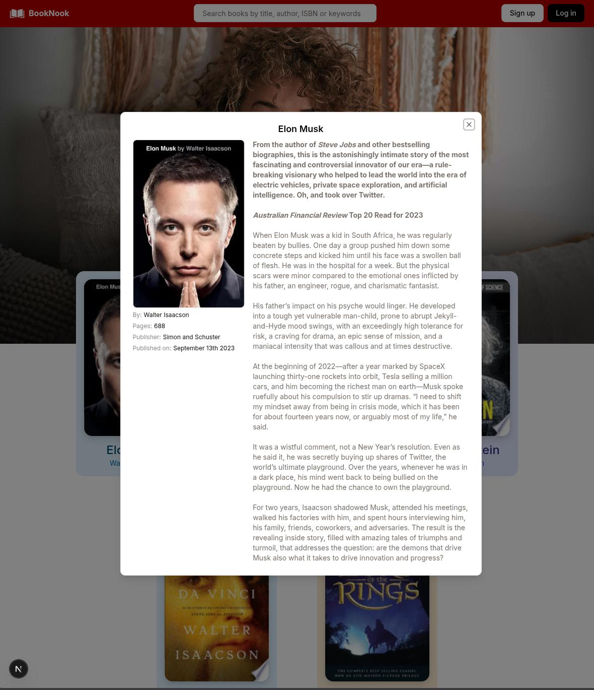
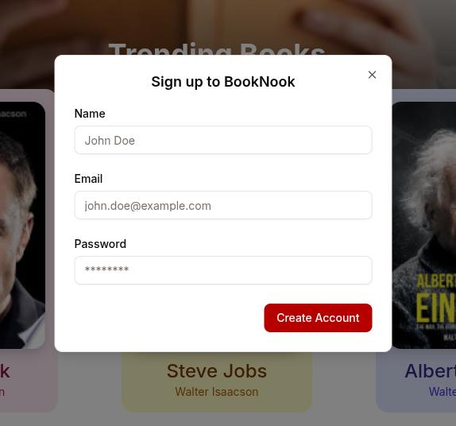
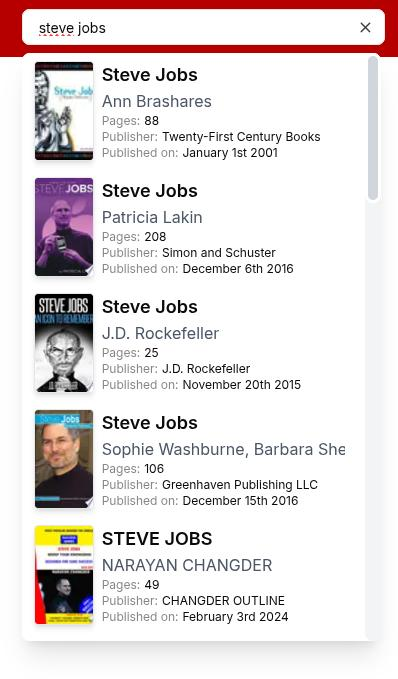
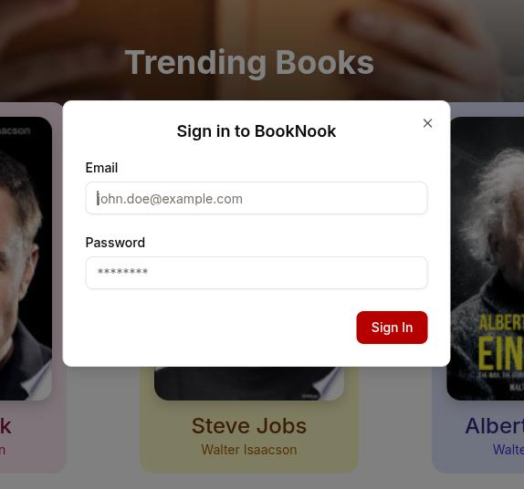
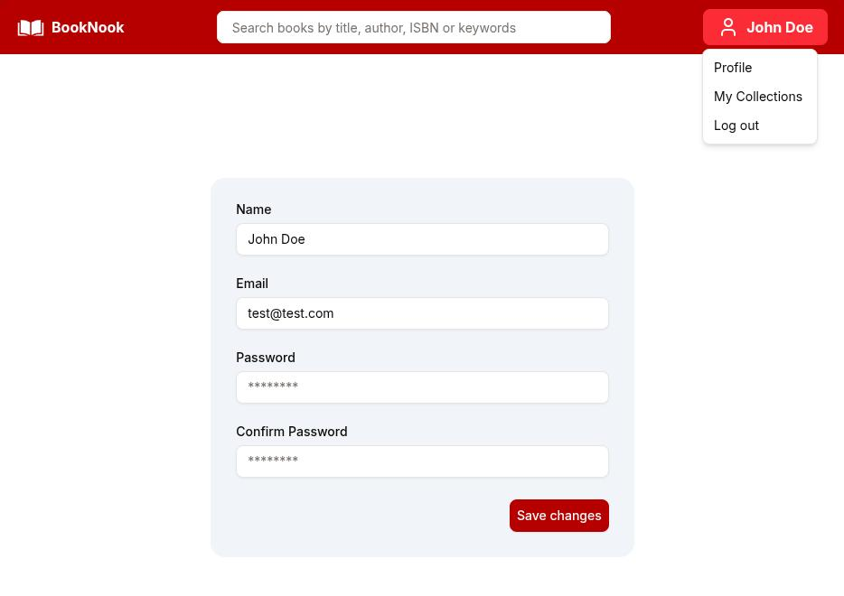
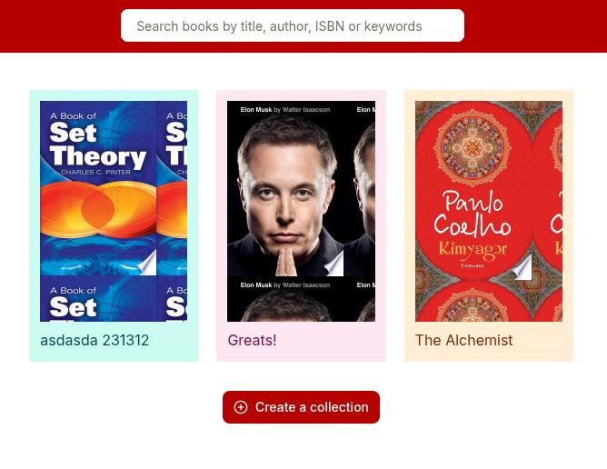
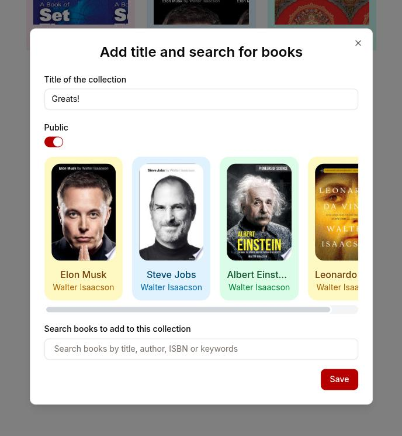

# Booknook

Book store web app built using React, Next.JS, Express, MongoDB, etc.

## Demo

You can watch demo video tour here: https://github.com/kamilniftaliev/booknook/raw/refs/heads/main/public/demo.mp4

## Screenshots

## Features

1. Searching books using Google Books API;
2. Trending books;
3. Adding, Editing, Removing collections;
4. Editing profile info;
5. Random cover images;

## Instructions

1. Add `MONGODB_URI` in your `.env` file;
2. Install dependencies with `yarn` or `npm install`;
3. Run the development server with `npm run dev` or `yarn dev`;
4. Open [http://localhost:5000](http://localhost:5000) with your browser to see the result.
